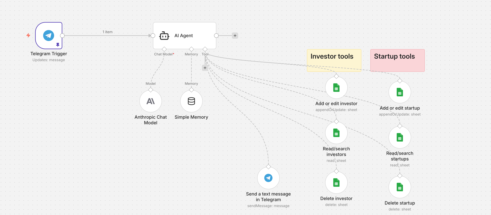

# Dealflow CRM Bot

An AI-powered dealflow management system that runs on Telegram. Track startups and investors, get automatic matching suggestions, and check for portfolio conflicts—all via chat.

Built with n8n, Claude, and Google Sheets.


*The n8n workflow powering the Dealflow CRM bot*

## Features

- **Add startups and investors** via natural language ("New startup: Acme, fintech, seed stage, building invoicing tools")
- **Automatic enrichment** - searches the web to add public information about companies and people
- **Smart matching** - when you add a startup, automatically suggests matching investors (and vice versa)
- **Portfolio conflict detection** - checks if an investor has backed competitors
- **Simple queries** - ask questions like "Who's a good fit for Acme?" or "List all my fintech investors"
- **Update and delete records** via chat
- **Conversation memory** - handles follow-up messages naturally

## Architecture

```
Telegram → n8n → AI Agent (Claude) → Tools:
                                      ├── Google Sheets (read/write)
                                      └── Telegram (send replies)
```

## Prerequisites

You'll need accounts and API keys for:

- [n8n](https://n8n.io) - workflow automation (free tier available)
- [Telegram](https://telegram.org) - for the chat interface (free)
- [Google Account](https://google.com) - for Google Sheets (free)
- [Anthropic](https://console.anthropic.com) - Claude API key (pay per use)

## Setup Guide

### 1. Create the Google Sheet

1. Create a new Google Sheet named "Dealflow CRM"
2. Create two tabs (sheets):

**Tab 1: "Startups"** - Add these headers in row 1:
```
name | sector | stage | description | contact | notes | date_added
```

**Tab 2: "Investors"** - Add these headers in row 1:
```
name | firm | sectors | stages | what_excites_them | notes | date_added
```

3. Note your spreadsheet ID from the URL:
```
https://docs.google.com/spreadsheets/d/[THIS_IS_YOUR_ID]/edit
```

### 2. Create the Telegram Bot

1. Open Telegram and search for **@BotFather**
2. Send `/newbot`
3. Choose a name (e.g., "Dealflow Assistant")
4. Choose a username (must end in `bot`, e.g., `my_dealflow_bot`)
5. Save the API token BotFather gives you
6. Send a message to your new bot to initialize the chat

### 3. Get API Keys

**Anthropic (Claude):**
1. Go to [console.anthropic.com](https://console.anthropic.com)
2. Create an API key
3. Save it securely

### 4. Set Up n8n

#### Import the Workflow

1. Log into your n8n instance
2. Go to Workflows → Import from File
3. Upload the `dealflow-crm-workflow.json` file

#### Configure Credentials

You'll need to set up four credentials:

**Telegram:**
- Credential type: Telegram
- Bot Token: [your token from BotFather]

**Google Sheets:**
- Credential type: Google Sheets OAuth2
- Follow the prompts to connect your Google account

**Anthropic:**
- Credential type: Anthropic
- API Key: [your Anthropic API key]

#### Update Node References

After importing, you'll need to update:

1. **Google Sheets nodes** - Select your "Dealflow CRM" spreadsheet in each Google Sheets tool
2. **Telegram Trigger** - Verify it's using your Telegram credentials
3. **Telegram Send tool** - Verify credentials

### 5. Activate and Test

1. Save the workflow
2. Toggle the workflow to **Active**
3. Send a message to your Telegram bot:
   ```
   New startup: Stripe, fintech, payments infrastructure for the internet
   ```
4. The bot should respond and add the startup to your sheet

## Usage Examples

**Add a startup:**
```
New startup: Ramp, B2B fintech, Series C, corporate cards and expense management. Met CEO Eric Glyman at a conference.
```

**Add an investor:**
```
New investor: Sarah Chen, partner at Sequoia, focuses on B2B SaaS and developer tools, Series A and B
```

**Find matches:**
```
Who would be a good fit for Ramp?
```

**Check portfolio conflicts:**
```
Does Sequoia have any portfolio conflicts with Ramp?
```

**Update a record:**
```
Update Ramp: they just announced Series D
```

**Delete a record:**
```
Delete the startup Acme
```

**Query your data:**
```
List all my seed stage startups
How many fintech investors do I have?
```

## Costs

Estimated costs for moderate usage (50 startups/investors per month):

| Service | Estimated Cost |
|---------|---------------|
| n8n | Free tier or ~$20/month |
| Anthropic | ~$1-5/month |
| Google Sheets | Free |
| Telegram | Free |

## License

MIT License - feel free to use and modify.

## Contributing

PRs welcome! Ideas for improvements:
- Voice message support (transcription)
- Pitch deck analysis (PDF upload)
- Multi-user support
- Notion/Airtable backend
- Deeper web research (Tavily integration)
